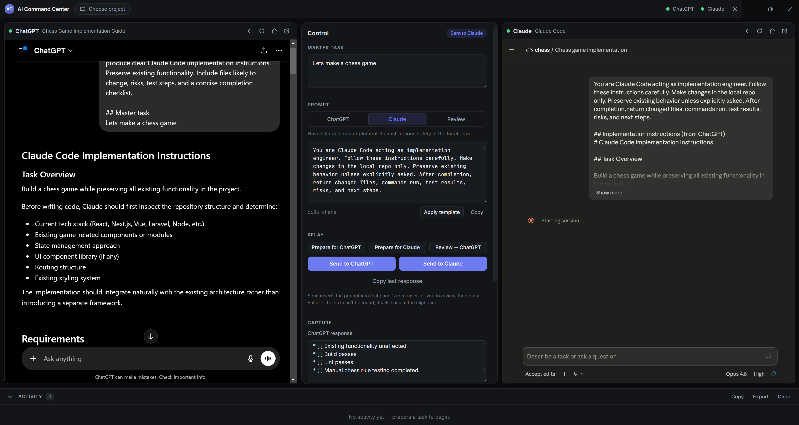

# AI Command Center

**Run ChatGPT and Claude side by side in one calm, professional desktop window — and relay prompts between them with you in control of every step.**



A Windows desktop app (Electron + TypeScript + React) that hosts your **ChatGPT.com** and **Claude.ai** sessions in two native panels, with a center "control panel" for shaping prompts, moving them between the two assistants, and keeping a local, plain‑Markdown memory of your tasks and decisions.

> **Status:** a working MVP, shared in the hope it's useful. It's **provided as‑is** — ChatGPT and Claude are third‑party web apps that change often, so parts of this (especially prompt insertion) may break over time. See [Limitations](#limitations) and [License](#license). **Free to use, free to fork, free to make better.**

---

## Why this exists

If you work with both ChatGPT and Claude, you end up juggling browser tabs: copying a plan out of one, pasting it into the other, copying the result back, losing track of which version is which. AI Command Center turns that into a single, deliberate workspace:

- **One window, two assistants** — both logged in, both visible, no tab‑hopping.
- **A relay you drive** — prepare a prompt with a template, drop it into the right assistant, review, send. Bring the reply back and pass it onward.
- **Memory that's yours** — your tasks, decisions, and prompt history live as Markdown files in a folder you choose, readable in any editor.

It's a *cockpit for the web apps you already pay for* — not a bot, not a scraper, not an API wrapper.

---

## What it does today

- **Side‑by‑side embedded panels** for ChatGPT.com and Claude.ai using Electron `WebContentsView`, each with its own **persistent, isolated login session** (your logins survive restarts). If a site refuses to embed, the panel **falls back** to opening it in your real browser.
- **Center control panel**: a master‑task field, a prompt composer with three built‑in **relay templates**, and the relay buttons.
- **Send → inserts into the composer.** "Send to ChatGPT" / "Send to Claude" puts the prepared prompt **into that site's message box for you to review** — it does **not** press send. You read it and hit Enter yourself. (If the composer can't be found, it falls back to copying the prompt to your clipboard and tells you to paste.)
- **Manual capture**: paste each assistant's reply into a labeled box and relay it onward with one click.
- **Project memory**: pick a folder and the app maintains `TASKS.md`, `DECISIONS.md`, `AI_LOG.md`, `CLAUDE_PROMPTS.md`, and `CHATGPT_PROMPTS.md` — append‑only, timestamped, plain Markdown.
- **Activity log** of every action, with copy/export.
- **Settings**: default project folder, workflow mode (manual / assisted hints), theme (dark / system), an optional **Auto‑send** toggle (off by default), and **Debug logging** (shows which selector inserted the prompt, or why it failed).
- **Reload‑loop protection** and a real, version‑consistent Chrome user‑agent so the embedded sessions behave.

---

## What it deliberately does *not* do — and why

It would be tempting to make the two assistants talk to each other **automatically**: one auto‑sends, the other auto‑replies, around and around in a hands‑off loop. **This app does not do that, on purpose** — for safety *and* because it would cross the line the services draw in their terms.

- **The consumer web apps reserve automated access for their official APIs.** Anthropic's Consumer Terms prohibit *"accessing the Services through automated or non‑human means, whether through a bot, script, or otherwise,"* except via an Anthropic API key. OpenAI's Terms of Use prohibit *"automatically or programmatically extract[ing] data or Output"* and interfering with the service, including circumventing rate limits or protective measures. Quietly scraping replies out of ChatGPT.com / Claude.ai and looping them automatically would breach those terms.
- **Bot protection.** Both sites sit behind Cloudflare, which actively challenges non‑human / automated clients. End‑to‑end scripted automation fights that protection.
- **Login.** Google (and similar) sign‑in is blocked inside embedded browsers by design — you'll see *"This browser or app may not be secure."* So there isn't a clean, allowed way to fully automate authentication either.

The sanctioned way to build a fully automated ChatGPT↔Claude pipeline is the **paid developer APIs** (the [OpenAI API](https://platform.openai.com/) / [Anthropic API](https://www.anthropic.com/api)) — a different product, with different terms and metered cost. This project is intentionally the *other* thing: a **human‑in‑the‑loop relay** for the web apps, where **you approve every send** and paste replies back yourself.

To stay on the right side of that line, AI Command Center:

- **never auto‑submits by default** (Auto‑send is an opt‑in setting, off out of the box);
- **never scrapes or reads** the assistants' responses — you copy them in;
- **doesn't loop on its own** — there is no background automation;
- **doesn't touch your credentials** — you log in normally; sessions are ordinary browser sessions stored locally.

The one thing it *does* do to save you a paste: it **inserts** your prepared prompt into the composer for review. That's a convenience, and it's why everything stays manual and logged. If you'd rather it never script the page at all, leave the panels as plain browsers and use the clipboard.

> *Sources: [OpenAI Terms of Use](https://openai.com/policies/row-terms-of-use/), [Anthropic Consumer Terms of Service](https://www.anthropic.com/legal/consumer-terms). Terms change — check the current versions, and use this tool in accordance with them.*

---

## Safety model (the short version)

No hidden automation · no scraping · no auto‑submit by default · no stored passwords · no API keys · everything you do is logged locally. The app is a clipboard‑and‑composer assistant with a memory — the thinking, the sending, and the copying stay with you.

---

## Requirements

- **Windows 10 or 11**
- **Node.js 18+** and npm
- A normal **ChatGPT** and/or **Claude** account (you log in inside the app)

---

## Getting started

```bash
npm install
npm run dev        # launches the app with a hot-reloading renderer
```

### Build

```bash
npm run build      # compiles main, preload, and renderer into out/
npm run typecheck  # strict TypeScript check (main + renderer)
```

### Package a Windows installer

```bash
npm run build:win  # produces an NSIS installer in dist/
```

The installer is **unsigned**, so Windows SmartScreen will show a *"More info → Run anyway"* prompt — normal for self‑built apps.

> Note: the dev build and the installed build share a single‑instance lock, so close one before launching the other.

---

## How the relay works

The relay is a guided, manual loop. The app prepares and inserts prompts; **you** review and send. Every step is logged.

1. **Enter your task** in the composer's task field.
2. **Prepare for ChatGPT** — applies the director template and fills the composer.
3. **Send to ChatGPT** — inserts the prompt into ChatGPT's box. **Review it, then press Enter.**
4. **Copy ChatGPT's reply** into the *ChatGPT response* box.
5. **Use as input → Claude** — wraps that reply with the engineer template.
6. **Send to Claude** — inserts it into Claude's box. Review, press Enter.
7. **Copy Claude's reply** into the *Claude response* box.
8. **Review → ChatGPT** — sends the result back for review, and the cycle continues as far as you want.

Nothing advances on its own — the stage indicator is advisory, and you decide every step.

### Prompt templates

| Template | Role |
| --- | --- |
| **A — Director → ChatGPT** | Frame your task so ChatGPT produces clear implementation instructions. |
| **B — Engineer → Claude** | Hand ChatGPT's instructions to Claude to implement. |
| **C — Review → ChatGPT** | Send Claude's result back to ChatGPT for review and the next step. |

### Project memory files

When a project folder is selected, the app maintains these inside it (append‑only, human‑readable):

- `TASKS.md` — task and relay‑stage snapshots
- `DECISIONS.md` — decisions you choose to record
- `AI_LOG.md` — exported activity timeline
- `CHATGPT_PROMPTS.md` / `CLAUDE_PROMPTS.md` — archives of the prompts you sent

---

## Keyboard shortcuts

| Shortcut | Action |
| --- | --- |
| `Ctrl + 1` | Focus the ChatGPT panel |
| `Ctrl + 2` | Focus the Claude panel |
| `Ctrl + Enter` | Send to the active template's target |
| `Ctrl + ,` | Open settings |

---

## Limitations

This is an MVP that drives two third‑party web apps it doesn't control. Expect rough edges:

- **Prompt insertion can break.** ChatGPT/Claude change their page structure over time. The app tries several selectors and, if none match, falls back to the clipboard and says so — turn on **Settings → Debug logging** to see which selector worked or why it failed.
- **A site may refuse to embed** → use the panel's **Open in browser** button.
- **Google / SSO sign‑in is blocked in embedded browsers** (by Google) → use **email login** in the panel, or sign in via your browser. Email/password and email‑code logins work fine in‑panel.
- **Cloudflare challenges** can appear on a fresh, logged‑out session; the app caps runaway reloads to protect your account.
- No guarantee it will keep working as the sites evolve. It's shared as‑is.

---

## Tech stack

Electron · electron‑vite · TypeScript (strict) · React 18 · Vite · electron‑builder. The renderer talks to the main process only through a typed `window.api` bridge (contextIsolation on, no Node in the UI).

## Project structure

```
src/
  shared/types.ts          # IPC + data contract (single source of truth)
  main/                    # main.ts, viewManager.ts, ipc.ts, projectFs.ts, store.ts, preload.ts
  renderer/
    App.tsx                # state, relay logic, bounds-sync, theme, keyboard
    components/            # TopBar, BrowserPanel, ControlPanel, PromptComposer,
                           # ActivityLog, SettingsPanel, ui/{Button,StatusDot,Toast}
    lib/                   # promptTemplates, projectFiles, storage
    styles/globals.css     # design tokens (dark + light/system)
```

---

## Contributing

PRs and forks are welcome — **make it better.** Useful directions: more resilient composer selectors, a macOS/Linux build, richer project memory, an optional API‑backed mode kept separate from the web‑session relay. Please keep the human‑in‑the‑loop, no‑scraping spirit intact.

## License

[MIT](LICENSE) — free to use, copy, modify, and distribute, **with no warranty**. Provided "as is"; it may stop working as ChatGPT and Claude change, and that's expected.

## Disclaimer

Not affiliated with, endorsed by, or sponsored by OpenAI or Anthropic. "ChatGPT" and "OpenAI" are trademarks of OpenAI; "Claude" and "Anthropic" are trademarks of Anthropic. Use this tool in accordance with each service's Terms of Service. You are responsible for how you use it.
